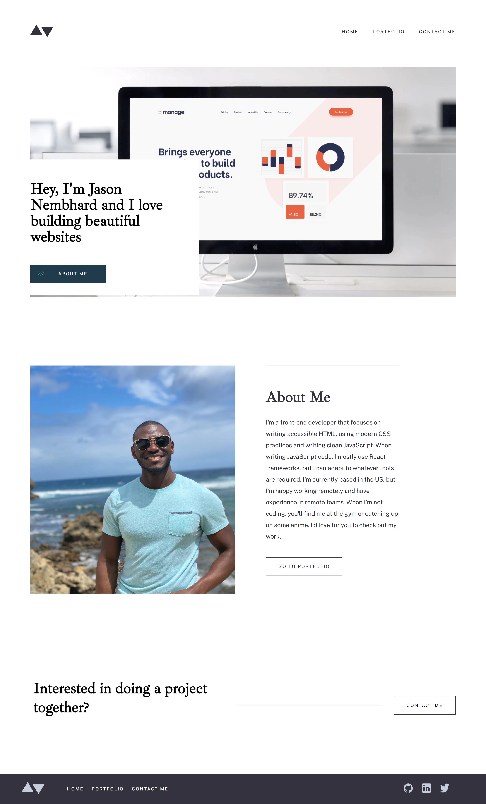

# Portofolio V2

## Table of contents

- [Overview](#overview)
  - [The challenge](#the-challenge)
  - [Screenshot](#screenshot)
  - [Links](#links)
- [My process](#my-process)
  - [Built with](#built-with)
  - [What I learned](#what-i-learned)
  - [Continued development](#continued-development)
- [Author](#author)

## Overview

### Screenshot



### Links

- Live Site URL: [Portfolio V2](https://www.jasonnembhard.com)

## My Process

### Built with

- Semantic HTML5 markup
- Styled Components
- Next JS
- Mobile-first workflow
- [Next.js](https://https://nextjs.org/) - React Framework
- [Styled Components](https://styled-components.com/)
- [Framer Motion](https://www.framer.com/docs/animation/)

### Background

My portfolio was long overdue for an update. The first time around, I had created my portfolio with the goal of having a place to put my projects up online as quickly as possible.

I had attempted to open my screen and start coding immediately running into A LOT of problems. Fast to market, hard to maintain. I've since become a better developer and decided to opt for code that is maintainable.

I made sure to assess which tool would be best for completing the job first. My framework of choice was Next JS. I first started with Redux and realized this would be a great chance to try out the dynamic routing option as an alternative to Redux. I was able to save so much time implementing code with just a few lines:

```js
export async function getStaticPaths() {
  const paths = portfoliodata.map((portfolio) => ({
    params: { portfolio: portfolio.slug },
  }));
  return { paths, fallback: false };
}

export async function getStaticProps({ params }) {
  const portfolio = portfoliodata.find(
    (portfolio) => portfolio.slug === params.portfolio
  );
  return { props: { portfolio } };
}
```

See how much easier that is? Before I would have figure out a way to manage state of dynamic pages accross the site at multiple locations. That same work is done here in basically 10-12 lines of code! Data is pulled from a data.js file which is then updated with the slug change. Seriously, once you finish writing this up, that pretty much handles all the work for your dynamic pages.

I also focused a bit on performing some custom email validation. The input boxes would turn red when incorrect information was entered or you tried to submit the form without filling out all the input boxes. Successful validation would result in green borders around the boxes and reset forms upon submission.

### Continued development

This project went pretty well overall. I just had to fix some basic logic with emailJS firing correctly, but I didn't have too much trouble.

## Author

- Website - [Jason Nembhard](https://www.jasonnembhard.com)
